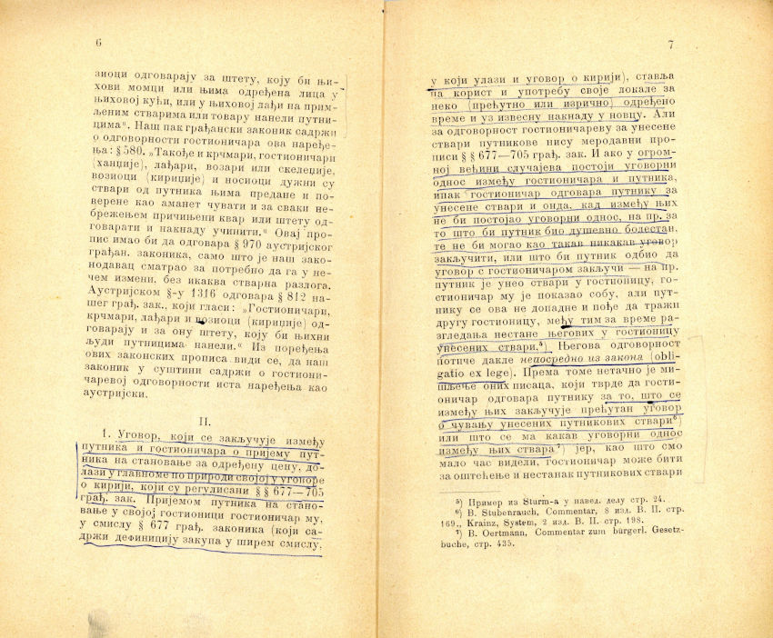
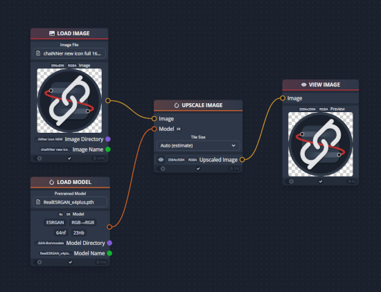

import { Image } from 'astro:assets';
import left from '../../../assets/clean-left.png';
import right from '../../../assets/clean-right.png';

This is one of the most common steps in Digitization, every type of material can have some damages or additions on it. As mentioned in the previous chapter.

#### Book and other printed textual material

Let's start with books and other printed textual material. The most common problem with scanning of this type material is reader’s underlines and notes additions in the margin. If the owner of the material is an important person in a community then these notes on margins are of importance, else this needs to be removed.
This makes a problem in the process of OCR (Optical Character Recognition), underlined text is harder to export.

If a book is not complete (missing pages), please don’t scan it. Only complete books need to be scanned. If a book is partly or completely outbound be careful while scanning, but in this process bring her back to life.

There are two practices used in printed text preparation. The first is to leave the colors as is, which means if a paper is yellow then the final file must be in the same color as the original.
The second is to clean the original colors and create black and white version of scan. The second approach is better for OCR, it gives better results for text extraction.

Of course if a printed material is in color, like magazines, etc. the best is to leave it in original colors. One of the best software for cleaning and preparing the multipage printed material is ScanTailor. There is an improved version named ScanTailor Advanced, that continues the development and support and has more options.
It can be installed in Linux and Windows.

Download from this link: https://github.com/ScanTailor-Advanced/scantailor-advanced/releases/tag/v1.0.19 

More about functions of this software check this link
https://github.com/ScanTailor-Advanced/scantailor-advanced 

This software offer these tools:
Rotate the page
Split two pages (if scanned material is of both pages, open book)
Deskew (correct the orientation of printed material on page)
Select Content (select the content on the page, all page or only text)
Margin (add margins to selected content)
Output (options of resolution, black and white or color or mixed, threshold, remove dirts, correct deformation)
All files are exported in TIFF format.

Here is an example of original scan and cleaned files.

Fig. 1 Original scan

<Image src={left} alt="Clean Left" width="450"/>

Fig. 2 Cleaned page 6

<Image src={left} alt="Clean Left" width="450"/>

Fig. 3 Cleaned page 7

In this example the pages are exported in black and white format that extremely lowers the file size.  Original scan is 7.6 Mb while tif files are 48.6 Kb and 49.1 Kb in B&W format. Black and White format binarize the image into Black and White colors only, it removes the background color and improves the text. 

Mixed mode also is available, this option is good for combining the photo and text on page, it simply selects the photo on page and leaves it in original format and the text in B&W.

In this process the shadow on the scan can result in black color on the page, experiment with options of threshold to produce best results.

### Other image types
For other image types like old photographs, postcards, maps, manuscripts… 

The main problem with these types of materials are scratches, missing parts, sharpness…

The most used FLOSS alternative to Adobe Photoshop is Gimp. It is regularly updated, cross platform. This software can be used for image manipulation, resize, crop, enhance contrast, … even repair which is a more demanded assignment.
Gimp can be downloaded on this link: https://www.gimp.org/downloads 

In the last several years development of AI technology produces models used for image and face restoration, and they are open sourced. One software chaiNNer tries to collect as many AI models for image restoration as possible. It is cross platform and can be installed easily on Linux and Windows.
It can be downloaded on this link https://chainner.app/download 

Work in this software is node based, that means connect nodes (that define step) and here is a screenshot of simple node composition.

  Fig. 5 chaiNNer simple screenshot 
(source: https://github.com/chaiNNer-org/chaiNNer) 

More about available models and functions on this link https://github.com/chaiNNer-org/chaiNNer 

### Audio materials
As we saw in the previous chapter there are different sources for audio material. Vinyl records, audio cassettes, CDs, even DVDs.

For vinyl records most problematic is pops and clips. Even if it is well cleaned, it is usual. Use the same software Audacity for cleaning this. The simple manual from their website is shown on this link https://support.audacityteam.org/repairing-audio/removing-clicks-pops 

For audio cassettes the most problematic is noise. This, also, can be removed in Audacity using the Noise reduction plugin. The simple manual from their website how to use this plugin is shown on this link https://support.audacityteam.org/repairing-audio/noise-reduction-removal 

CDs and DVDs are in digital format so most of them are without classic analogue problems.

Depending on digital repository software, export the files in mp3 or wav format.

### Video materials
Video editors have included some plugins that can serve for video quality improvement, depending on software there are different solutions. The main quality improvements available are color and image correction, de noise, white balance and contrast.
FLOSS softwares used for video editing are

Kdenlive, a multiplatform software with a lot of available plugins and can be downloaded from this link https://kdenlive.org/en/download 

Shotcut is another multi platform video editor with wide choice of plugins, can be downloaded from this link https://www.shotcut.org/download 

Export in mp4 format, it is the most used format for video.