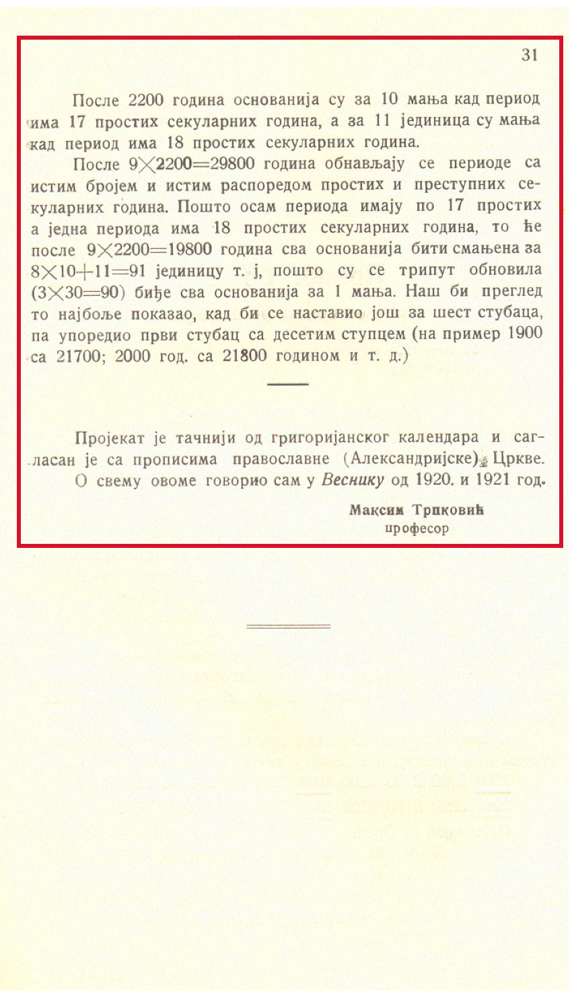

### Увод
На тржишту тренутно постоји много врста скенера а неки од њих су прескупи за мање установе културе. Равни скенер А3 формата се показао као уређај којим може да се покрије највећи обим текстуалне грађе и фотографија:

* књиге
* рукописи
* мапе
* новине
* часописи
* белешке
* фотографије
* разгледнице и дописне карте

Данас постоје специјализовани скенери за скенирање филмских негатива и слајдова који дају боље резултате код скенирања фотографија, разгледница и дописних карата. Ови скенери су, тренутно, веома приступачни.

Сви скенери имају имају сопствени софтвер за скенирање али један део њих не подржава све верзије Linux-a. Уколико радите на Линукс оперативном систему пре набавке скенера проверите његову компатибилност са овим ОС.

Једно од могућих решења за скенере који немају подршку за одређене верзије Linux-a је инсталација Xsane софтвера. Софтвер се може преузети са скоро свих менаџера пакета за Linux дистрибуције.

### Формати

Препорука је да се сви скенирани материјали чувају у некомпримованом TIFF формату резолуције 300 dpi (тачака по инчу). Тај материјал се зове мастер копија и служи за архивирање у најбољем квалитету. Препорука за фотографије и разгледнице је 600 dpi у TIFF формату. Како сви скенери имају сопствени софтвер за скенирање али нису сви подржани од стране одређених Linux дистрибуција, неопходно је проверити пре набавке скенера да ли је потребан посебан програм.

### Употреба
Употреба скенера је крајње једноставна. Материјал за скенирање се поставља на стакло за скенирање и након одређивања маргина вршимо скенирање.

### Процес
Први дефинишите формат и резолуцију у софтверу за скенирање, препорука је да изаберете TIFF формат и резолуцију од 300 dpi за штампане и руком писане материјале, 600 dpi за слике, фотографије, слајдове и филмове.

### Књиге, рукописи, новине и часописи
Приликом скенирање ове врсте грађе, слободно процените да ли ћете скенирати једну или две стране истовремено.

#### НИКАДА НЕМОЈТЕ СКЕНИРАТИ САМО ТЕКСТ!

Уколико су димензије отворене грађе веће од максималне величине коју подржава ваш скенер скенирајте страну по страну. Уколико величина једне стране грађе премашује димензије скенера постоје две опције:
* скенирајте страну у више делова а затим их спојите касније уз помоћ наменског софтвера;
* користите фото апарат.

### Фотографије, разгледнице и дописне карте

Када се скенира ова врста грађе, у случају када постоји садржај на две стране, скенирајте их обе. Задња страна разгледница и дописних карти може садржати писани текст и/или поштанске марке док фотографије могу имати писане белешке, што може бити драгоцена информација коју можете унети у метаподатке.

### Филмски негативни и слајдови

За скенирање ове врсте грађе користите специјализоване скенере који имају држаче за слајдове и филмове. Ове врсте скенера већином подржавају високу резолуцију која ће увећати резолуцију скенираног грађе с обзиром на то да су димензије филма и слајдова мале. Крајњи резултат ће бити скен велике резолуције који ће бити бољи за преглед на екрану.
