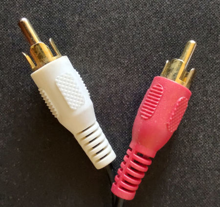
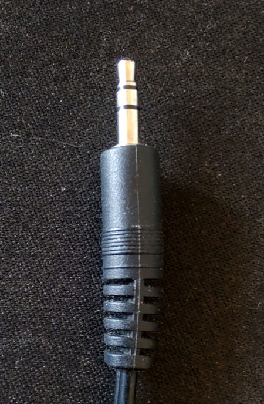

### Увод
Снимање звука је специфично јер зависи од врсте аудио извора. Историја снимања звука је дуга, а формати у којима је сниман су се мењали током времена. У овом одељку ћемо се фокусирати на неке од најчешћих формата који се могу наћи у мањим установама културе.

- LP и сингл плоче (33, 45 и 78 обртаја)
- аудио касете
- компакт диск (CD)
- аудио снимци

Наведеним форматима одговарају ови уређаји за репродукцију:

- грамофон за плоче
- Аудио касетофон
- CD плејер

Опрема за снимање

- рачунар
- екстерна USB звучна карта
- уређај за репродукцију
- слушалице или звучник

### Употреба
За снимање звука препоручује се употреба екстерне USB звучна картице, на тржишту постоје пристојне звучне картице и дигитални миксери (2 каналa) који ће дати добар и квалитетан снимак. Екстерне звучна картица има уграђен А/D конвертор (аналогно-дигитални претварач сигнала) који претвара аналогни аудио сигнал у дигитални. Квалитет екстерних аудио картица је бољи од интегрисаних аудио картица на рачунару или лаптопу. На звучној картици постоји више типова улаза аудио сигнала, RCA стерео (црвена и бела) на пример, који се налази код већине аудио уређаја као излаз.

Недостатак приликом снимања звука је време потребно за аудио конверзију, сви процеси морају ићи 1:1, односно, трајање звучног записа једнако је временау које је потребно за снимање. Ако имате касету која траје 90 минута, планирајте да ће и снимање трајати, најмање, 90 минута.

За снимање је потребан аудио уређај, аудио картица, рачунар, каблови, звучници или слушалице и грађа. Када се све ово повеже, потребно је само покренути аудио запис, на рачунару кликнути, у програму, дугме за снимање и слушати.

Ручни аудио снимачи могу да се користе за снимање интервјуа (на пример занимљивог члана заједнице), урбаног окружења, птица... Сви данашњи модели су дигитални и снимљени записи се лако преносе на рачунар.

Један од најчешће коришћених бесплатних софтвера отвореног кода за снимање/уређивање звука је Audacity. Audacity је cross-platform софтвер што значи да је подржан од стране више оперативних система Linux, Windows and MacOS. Редовно се ажурира и једноставан је за руковање. Кратко упутство за снимање звука из микрофона (исти поступак важи и за линијски аудио улаз, проверити само сигнал - моно или стерео) можете погледати на следећој адреси: <a href="https://support.audacityteam.org/basics/recording-your-voice-and-microphone" target="_blank">support.audacityteam.org/basics/recording-your-voice-and-microphone</a>

### Процес
- Припремите грађу за снимање
- На уређају за репродукцију аудио снимка (грамофон, касетофон, CD плејер), проверите излазни канал (углавном RCA црвено и бело) и прикључите каблове
- На аудио картици користите “line in” канал и прикључите кабл пратећи боје (црвена и бела)
- На рачунару отворите софтвер за снимање звука и притисните Record или REC (црвена тачка)
- Репродукујте звук са уређаја
- Ниво снимања никада не сме да пређе нулти ниво, иначе ће звук бити исечен и изобличен. Препоручука је да се максимални ниво снимања подеси најмање 3–6 dB испод нуле.
- Фајл снимите у WAV формату, најчешће се користе подешавања 44.1 kHz и 16 bit. Моно снимци се снимају у моно фајлу, стерео снимци у стерео. Снимање са 96 kHz / 24 bit даје више могућности за накнадну корекцију звука, али величина фајла је двоструко већа па је потребно доста простора за складиштење.
- Код оригиналног дигиталног звука, аудио треба пренети са истом брзином узорковања(sampling rate)/дубином бита(bit depth) као што су снимљени. На пример ЦД-ови имају вредности 44.1kHz / 16 bit.

### Најчешћи проблеми
Током снимања звука могу се јавити неки уобичајени проблеми.

- Грамофонске плоче углавном имају мање или веће огреботине и прашину. Пре пуштања, препоручује се да очистите плочу са меким чистачем плоча (може се наћи у скоро свакој музичкој радњи). Већина плоча, током репродукције, производи пуцкетање. Ово се може очистити у софтверу, о овоме више у дигиталној припреми. Грешке настале прескакањем, као и оне у којима се делови снимка због оштећења плоче стално понављају, теже је накнадно поправити у софтверу јер прескочени део недостаје у снимљеном фајлу.

- Аудио касетофони углавном имају проблем са прљавом главом (део који чита траку). Препоручује се редовно чишћење главе памучним штапићем умоченим у апотекарски алкохол, пошто се грешке настале на аудио снимку услед прљаве главе тешко исправљају у накнадној обради.

- Квалитет снимања на траци може бити низак, са шумом и ниским нивоом сигнала. Овај проблем се такође може решити софтвером. Више о дигиталној припреми у следећим поглављима.

- Квалитет се често може побољшати ако се трака неколико пута премота напред-назад пре него што се дигитализује.

- Компакт диск, као и плоча, може бити изгребан што доводи до прескакања одређеног дела или константно враћање на исти део снимка. Ако се то догоди, доступни су комплети за полирање који могу поправити оштећену пластичну површину диска. Успешност поправке ће зависити од количине штете на површини диска. За ралику од плоче, када се чују кликови “кликови” на ЦД-у, значи да је диск при крају животног века или је већ неупотребљив.

- ЦД-ови имају прилично ограничен животни век, посебно они које сте сами снимали (резани). Препорука је да их што пребаците на уређај за дуготрајно складиштење.

Аудио каблови:

RCA кабл

3.5mm кабл

У зависности од врсте уређаја који користите потребни су различити каблови за снимање. Најчешћи прикључци који су употреби су RCA кабл или 3,5 mm miniplug (бананица). Многе USB звучне картице поседују улазе од 6,3 mm (велика банана) тако да вам је потребан кабл са RCA конекторима на једном крају за повезивање са уређајем за репродукцију и банана од 6,3 mm на другом крају за повезивање на звучну картицу.

### Додатне информације
Детаљније информације о дигитализацији аудио снимака могу се наћи, на пример, у документу организације Time Machine Organisation’s Audio Digitization Pipeline. Овај документ садржи информације о аудио форматима који у тексту изнад нису описани, као што су траке на отвореним ролнама, DAT траке и минидискови.
<a href="https://github.com/time-machine-project/requests-for-comments/blob/master/files/releases/RFC-0034/RFC-0034.md" target="_blank">github.com/time-machine-project</a>
