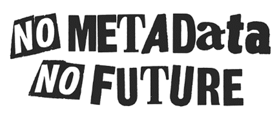

### Претраживост (Findable)
**Метаподаци и идентификатори**

Често је фокус је на стварању богате дигиталне документације која садржи (3D и) 2D слике, друге графичке податке, документе, цртеже, аудио датотеке и још много тога.

Као и добар садржај, потребни су нам и висококвалитетни метаподаци:
* како  бисте омогућили корисницима да пронађу садржај претраживањем различитих кључних речи, датума, предмета, аутора итд.
* како би се омогућило чување и поновна употреба.

Идентификатори играју суштинску улогу: морају бити јединствени и дуготрајни што је више могуће

Трајни идентификатори (PID) представљају јединствену УРЛ адресу која идентификује ваш објекат, коју подржава систем и организација које су обавези да одржавају PID запис, нпр. Дигитални идентификатори објеката (DOI), Handle, ARK, или PURL.

### Доступност (Accessible)
Accessible: Складиштење и стандарди\
FAIR принципи се фокусирају на то где се подаци чувају (поузданост), како се могу преузети (протоколи) и стандарди.

Многе организације чувају своје податке у институционалним репозиторијумима.

Такође, постоје и поуздани национални репозиторијуми.

Пример за то је Холандија\
<a href="https://dans.knaw.nl/en/data-services/data-vault" target="_blank">dans.knaw.nl/en/data-services/data-vault</a>

Међународни дигитални репозиторијум: <a href="https://zenodo.org/" target="_blank">zenodo.org</a>

Подаци треба да буду што је могуће стандардизованији што помаже у даљем управљању.

FAIR принцип, отворени колико год је то могуће: “Отворени колико год је то могуће и затворени колико је то неопходно”

Ако корисници морају да контактирају библиотекара како би приступили копији података онда тај систем није отворен!

Корисницима треба да се омогући да податке на мрежи пронађу брзо и самостално успеју да им приступе.

### Интероперабилност (Interoperable)
Користите стандарде и изразе предвиђене за опис метаподатака\
Метаподаци описују дигиталне податке које сте створили током дигитализације вашег културног наслеђа. На пример, опис грађе, оригинална и / или тренутна локација, када је настала и ко је аутор. Наравно, ово је релевантно само уколико имате те информације.

Кључни појмови за метаподатке о културном наслеђу су:
* Информације о пројекту – обим, циљеви, датум, методе и технике
* Културно наслеђе – објекат који је дигитализован
* Дигитални подаци – како су подаци настали, информације о дигиталном објекту, приступ подацима (укључујући права и лиценцирање).

Речници\
Штампани речници и листе речи су одлични за побољшање конзистентности ваших података, али повезани (отворени) подаци су супериорнији

На пример, Getty’s Art and Architecture Thesaurus:
* Јединствени идентификатори (UIDs) за сваки појам
* Појмови су доступни на више језика.
* Шири и ужи појмови.

За локације, можете користити на пример стандардни речник Geonames.org

Погледајте одељак Алати за корисне линкове.

### Поновна употреба (Reusable)
окус FAIR принципа је могућност интеграције туђих података у свој пројекат и обрнуто.

Поновна употреба значи приступ не само подацима, већ и њиховој документацији и подацима који су доступни под одговарајућом лиценцом.

Лиценце\
Изјаве о лиценцирању права изражавају статус ауторских права дигиталног објекта и пружају информације о томе како неко може поново користити објекат. Стандардизоване изјаве о правима (на пример са Creative Commons или RightsStatements.org) пружају информације о правима јасним и једноставним језиком и читљиве су машински.

Објављивање података са стандардизованом изјавом о правима подржава FAIR принципе.

Погледајте поглавље 1 Планирање пројекта за више информација о лиценцирању и погледајте одељак Алати за спољашње везе.
